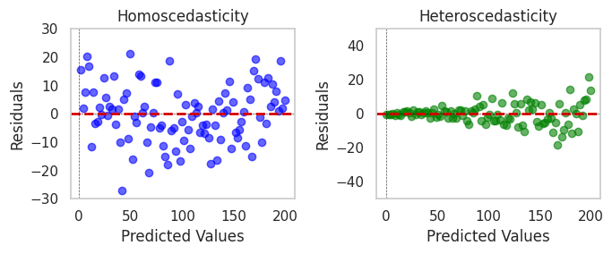

# Machine Learning

## [1] Linear Regression

1. **Derivation of Linear Regression**
   - Linear regression models the linear relationship between a dependent variable $y$ and one or more independent variables $x_i$ by fitting a linear equation to observed data.
   - **Simple Linear Regression**
     - In simple linear regression, we estimate the coefficients $b_0$ (intercept) and $b_1$ (slope) as follows:
     - Given a dataset with $n$ observations $\{(x_1, y_1), (x_2, y_2), \dots, (x_n, y_n)\}$, we aim to fit a line of the form
     - >$y = b_0 + b_1 x$
     - The formulas for $b_0$ and $b_1$ are:

       >1. **Slope ($b_1$)**:
         $b_1 = \frac{\sum_{i=1}^n (x_i - \bar{x})(y_i - \bar{y})}{\sum_{i=1}^n (x_i - \bar{x})^2}$
          where $\bar{x}$ and $\bar{y}$ are the means of $x$ and $y$, respectively.
       >2. **Intercept ($b_0$)**: $b_0 = \bar{y} - b_1 \bar{x}$
          - **Mathematical Expression**:
            - >$y = \beta_0 + \beta_1 x_1 + \beta_2 x_2 + \dots + \beta_p x_p + \epsilon$
            where:
            - $y$ is the dependent variable.
            - $x_i$ are independent variables.
            - $\beta_i$ are coefficients.
            - $\epsilon$ is the error term.

2. [**Assumptions of Linear Regression**](https://www.geeksforgeeks.org/assumptions-of-linear-regression/)
   - **Linearity**:
     - This assumption states that there is a linear relationship between the predictor variables (independent variables) and the outcome variable (dependent variable). This means that the effect of any predictor on the outcome is constant, regardless of the values of other predictors.
     - Mathematically, the expected value of the outcome variable $y$ given the predictors $X$ should be linear in terms of the coefficients $\beta$:  
       $\mathbb{E}[y | X] = \beta_0 + \beta_1 X_1 + \beta_2 X_2 + \dots + \beta_p X_p$.
     - If the relationship is non-linear, linear regression may lead to biased estimates, as it cannot capture non-linear patterns.

   - **Independence**:
     - This assumption means that the residuals (errors) of the model are independent of each other. In other words, the residual of one observation should not depend on the residual of another observation.
     - This assumption is particularly important in time-series data, where autocorrelation (when errors are correlated with past errors) can violate independence.
     - Violations of this assumption can lead to underestimated or overestimated standard errors, affecting the reliability of hypothesis tests and confidence intervals. Techniques such as the Durbin-Watson test can help detect autocorrelation in residuals.

   - **Homoscedasticity of Residuals in Linear Regression**:
     - 
     - Homoscedasticity means that the variance of the errors (residuals) is constant across all levels of the independent variables. This assumption ensures that the error term does not systematically vary with changes in the independent variables.
     - Mathematically, it is expressed as $\text{Var}(\epsilon_i) = \sigma^2$ for all $i$, meaning the variance of the residuals is equal across all observations.
     - If the errors exhibit heteroscedasticity (non-constant variance), it indicates that the model's predictions may have varying accuracy across different values of predictors. This can be diagnosed by plotting residuals versus fitted values and looking for patterns. Techniques like weighted least squares (WLS) or robust standard errors can help correct for heteroscedasticity.

   - **Normality of Errors**:
     - This assumption states that the residuals (errors) of the model are normally distributed, particularly important for small sample sizes. This does not mean the predictors or the outcome must be normally distributed, but the residuals should be.
     - Normality of errors ensures that the regression coefficients have reliable hypothesis tests and confidence intervals based on the t-distribution.
     - Normality of residuals can be checked visually using a Q-Q (quantile-quantile) plot or tested using statistical tests like the Shapiro-Wilk test. For large samples, the central limit theorem helps mitigate the impact of non-normal errors.

   - **No Multicollinearity**:
     - This assumption requires that the predictor variables are not highly correlated with each other. If predictors are highly correlated, the model can have difficulty estimating the individual effect of each predictor on the outcome.
     - Multicollinearity inflates the variances of the coefficient estimates, making them unstable and sensitive to small changes in the data. This can lead to inaccurate p-values and wide confidence intervals.
     - Multicollinearity can be detected using the Variance Inflation Factor (VIF) or by checking the correlation matrix of the predictors. If multicollinearity is present, potential solutions include removing correlated predictors, combining them, or using dimensionality reduction techniques like Principal Component Analysis (PCA).

3. **Loss Function**
   - The objective is to minimize the sum of squared residuals:
     - $\min_{\beta_0, \beta_1} \sum_{i=1}^n (y_i - \beta_0 - \beta_1 x_i)^2$

4. **Metric**
   - **Mean Squared Error (MSE)**:
     >- $\text{MSE} = \frac{1}{n} \sum_{i=1}^n (y_i - \hat{y}_i)^2$
   - **Root Mean Squared Error (RMSE)**:
     >- $\text{RMSE} = \sqrt{\text{MSE}}$
   - **Mean Absolute Error (MAE)**:
     >- $\text{MAE} = \frac{1}{n} \sum_{i=1}^n |y_i - \hat{y}_i|$
   - **Coefficient of Determination $R^2$**:
     >- $R^2 = 1 - \frac{\sum_{i=1}^n (y_i - \hat{y}_i)^2}{\sum_{i=1}^n (y_i - \bar{y})^2} = 1- \frac{\textbf{MSE}(\text{Model})}{\textbf{MSE}(\text{Baseline})}$
   - **Adjusted $R^2$**:
     >- $R_{\text{adj}}^2 = 1 - \left( \frac{(1 - R^2)(n - 1)}{n - p - 1} \right)$

5. **[Bias-Variance Trade-off](https://mlu-explain.github.io/bias-variance/)**
   - <http://www.inf.ed.ac.uk/teaching/courses/mlsc/Notes/Lecture4/BiasVariance.pdf>
   - Balances the trade-off between the complexity of the model and its accuracy on unseen data.
   - >**Bias**
     >- The amount we are off the real function.
     >- Bias represents the difference between the average prediction and the true value.
     >- $\text{Bias}(x) = \mathbf{E}[\hat{f}(x)] - f(x)$
     >- For underfit (low-complexity) models, the majority of our error comes from bias.
   - >**Variance**
     >- Measures how much, on average, predictions vary for a given data point.
     >- $\text{Variance}(x) = \mathbf{E}\left[ \left(\hat{f}(x) - \mathbf{E}[\hat{f}(x)]\right)^2 \right]$
     >- For overfit (high-complexity) models, the majority of our error comes from variance.
   - Here’s the complete derivation of the bias-variance decomposition, based on the provided document:

   - > <http://www.inf.ed.ac.uk/teaching/courses/mlsc/Notes/Lecture4/BiasVariance.pdf> \
     >Given:
     >
     >- The true function $f(x)$ we want to approximate.
     >- The dataset $D = \{(x_1, t_1), (x_2, t_2), \dots, (x_N, t_N)\}$ where $t_i = f(x_i) + \epsilon_i$ and $\epsilon_i$ represents noise with mean zero.
     >- A trained neural network model, represented by $y = g(x; w)$, which approximates $f(x)$.
     >
     >The Mean Squared Error (MSE) of the neural network model is:
      >- $\text{MSE} = \frac{1}{N} \sum_{i=1}^N (t_i - y_i)^2$
     >
     >To assess the model's performance, we consider the expected MSE over many possible datasets drawn from the distribution:
      >- $\mathbb{E}[\text{MSE}] = \frac{1}{N} \sum_{i=1}^N \mathbb{E}[(t_i - y_i)^2]$
     >
     >Expanding this expectation, we have:
      >- $\mathbb{E}[(t_i - y_i)^2] = \mathbb{E}[(t_i - f(x_i) + f(x_i) - y_i)^2]$
      >- $\mathbb{E}[(t_i - y_i)^2] = \mathbb{E}[(t_i - f(x_i))^2] + \mathbb{E}[(f(x_i) - y_i)^2] + 2 \mathbb{E}[(t_i - f(x_i))(f(x_i) - y_i)]$
     >
     >Given that $t_i = f(x_i) + \epsilon_i$ and assuming $f(x_i)$ is deterministic, the cross-term $\mathbb{E}[(t_i - f(x_i))(f(x_i) - y_i)] = 0$ because $\epsilon_i$ is independent of the model's predictions.
     >
     >Thus:
      >- $\mathbb{E}[(t_i - y_i)^2] = \mathbb{E}[\epsilon_i^2] + \mathbb{E}[(f(x_i) - y_i)^2]$
      >- where $\mathbb{E}[\epsilon_i^2]$ is the variance of the noise.
     >
     >Now, decompose $\mathbb{E}[(f(x_i) - y_i)^2]$ further using the bias-variance augmentation:
      >- $\mathbb{E}[(f(x_i) - y_i)^2] = (\mathbb{E}[y_i] - f(x_i))^2 + \mathbb{E}[(y_i - \mathbb{E}[y_i])^2]$
      >- where $(\mathbb{E}[y_i] - f(x_i))^2$ is the **squared bias** and $\mathbb{E}[(y_i - \mathbb{E}[y_i])^2]$ is the **variance** of the model's predictions.
     >
     >Thus, the expected MSE can be expressed as:
     >$\mathbb{E}[(t_i - y_i)^2] = \text{Var}(\text{noise}) + \text{Bias}^2 + \text{Var}(\text{model})$
     >
     >This decomposition illustrates that minimizing the MSE requires reducing both the bias and the variance, while the noise term is irreducible.

   - Note that the variance of the noise can not be minimized; it is independent of theneural network. Thus in order to minimize the MSE, we need to minimize boththe bias and the variance. However, this is not trivial to do this. For instance, justneglecting the input data and predicting the output somehow (e.g., just a constant), would definitely minimize the variance of our predictions: they would bealways the same, thus the variance would be zero, but the bias of our estimate(i.e., the amount we are off the real function) would be tremendously large. Onthe other hand, the neural network could perfectly interpolate the training data,i.e., it predict y=t for every data point. This will make the bias term vanish entirely, since the E(y)=f (insert this above into the squared bias term to verify this),but the variance term will become equal to the variance of the noise, which maybe significant. In general, finding an optimal bias-variance tradeoff is hard, but acceptable solutions can be found, e.g., by means of cross validation or regularization.

6. **Regularization**
   - **Ridge Regression** adds an $L2$ penalty to the loss function.
   - **Lasso Regression** adds an $L1$ penalty to encourage sparsity in coefficients.
   - **Elastic Net** combines both $L1$ and $L2$ penalties.

7. **p-Value**
   - Used to determine the significance of predictors in the model.

## [2] Logistic Regression

1. **Introduction**
  
    Logistic regression is a statistical method used for modeling a binary outcome variable (dependent variable $Y$ that can take on two possible outcomes, typically coded as 0 or 1) based on one or more predictor variables (independent variables $X$). In simple logistic regression, we have one predictor variable. The goal is to model the probability that $Y$ equals 1 given $X$.

2. **The Logistic Function**

    To model the probability, we use the logistic (sigmoid) function, which maps any real-valued number into a value between 0 and 1:

    $P(Y=1|X) = \frac{1}{1 + e^{-(\beta_0 + \beta_1 X)}}$

    where:

    - $P(Y=1|X)$ is the probability that $Y = 1$ given $X$.
    - $\beta_0$ is the intercept term.
    - $\beta_1$ is the coefficient for the predictor variable $X$.
    - $e$ is the base of the natural logarithm.

    This function ensures that the predicted probabilities are between 0 and 1.

3. **The Logit Function**

    By rearranging the logistic function, we can express it in terms of the log-odds (logit):

    $\text{Logit}(P(Y=1|X)) = \ln\left( \frac{P(Y=1|X)}{1 - P(Y=1|X)} \right) = \beta_0 + \beta_1 X$

    This linear relationship between the log-odds and the predictor variable simplifies the analysis and estimation of the parameters.

4. **Likelihood Function**

    Given $n$ independent observations $(X_i, Y_i)$, where $Y_i \in \{0,1\}$, the likelihood function represents the probability of observing the data as a function of the parameters $\beta_0$ and $\beta_1$:

    $L(\beta_0, \beta_1) = \prod_{i=1}^n P(Y_i | X_i)$

    Since $Y_i$ is binary, we can express $P(Y_i | X_i)$ as:

    $P(Y_i | X_i) = [P(Y_i=1|X_i)]^{Y_i} [1 - P(Y_i=1|X_i)]^{1 - Y_i}$

    Substituting the logistic function into the likelihood:

    $L(\beta_0, \beta_1) = \prod_{i=1}^n \left( \frac{1}{1 + e^{-(\beta_0 + \beta_1 X_i)}} \right)^{Y_i} \left( \frac{e^{-(\beta_0 + \beta_1 X_i)}}{1 + e^{-(\beta_0 + \beta_1 X_i)}} \right)^{1 - Y_i}$

    Simplifying further:

    $L(\beta_0, \beta_1) = \prod_{i=1}^n \left( \frac{e^{\beta_0 + \beta_1 X_i}}{1 + e^{\beta_0 + \beta_1 X_i}} \right)^{Y_i} \left( \frac{1}{1 + e^{\beta_0 + \beta_1 X_i}} \right)^{1 - Y_i}$

5. **Log-Likelihood Function**

    To simplify calculations, we take the natural logarithm of the likelihood function to obtain the log-likelihood function:

    $\ell(\beta_0, \beta_1) = \ln L(\beta_0, \beta_1) = \sum_{i=1}^n \left[ Y_i (\beta_0 + \beta_1 X_i) - \ln(1 + e^{\beta_0 + \beta_1 X_i}) \right]$

    This form is derived by applying logarithm properties and simplifies the product into a sum, which is easier to differentiate.

6. **Maximum Likelihood Estimation (MLE)**

    To estimate $\beta_0$ and $\beta_1$, we maximize the log-likelihood function. This involves taking partial derivatives of $\ell(\beta_0, \beta_1)$ with respect to $\beta_0$ and $\beta_1$, setting them to zero, and solving for the parameters.

7. **Partial Derivatives**

   1. **Derivative with respect to $\beta_0$:**

      $\frac{\partial \ell}{\partial \beta_0} = \sum_{i=1}^n \left[ Y_i - \frac{e^{\beta_0 + \beta_1 X_i}}{1 + e^{\beta_0 + \beta_1 X_i}} \right]$

   2. **Derivative with respect to $\beta_1$:**

      $\frac{\partial \ell}{\partial \beta_1} = \sum_{i=1}^n \left[ Y_i - \frac{e^{\beta_0 + \beta_1 X_i}}{1 + e^{\beta_0 + \beta_1 X_i}} \right] X_i$

   3. **Simplifying the Derivatives**

      Define $\hat{P_i} = \frac{e^{\beta_0 + \beta_1 X_i}}{1 + e^{\beta_0 + \beta_1 X_i}} = P(Y_i = 1 | X_i)$.

      The partial derivatives become:

      1. **For $\beta_0$:**

          $\frac{\partial \ell}{\partial \beta_0} = \sum_{i=1}^n (Y_i - \hat{P_i})$

      2. **For $\beta_1$:**

          $\frac{\partial \ell}{\partial \beta_1} = \sum_{i=1}^n (Y_i - \hat{P_i}) X_i$

8. **Setting the Derivatives to Zero**

    To find the maximum of the log-likelihood function, set the partial derivatives to zero:

    1. **For $\beta_0$:**

        $\sum_{i=1}^n (Y_i - \hat{P_i}) = 0$

    2. **For $\beta_1$:**

        $\sum_{i=1}^n (Y_i - \hat{P_i}) X_i = 0$

    These equations are known as the **score equations**.
9. **Summary**

   >### 1. Define the Logistic Function
    >
    >The logistic regression model is built upon the logistic function:
    >
    >$p(y=1|x) = \frac{1}{1 + e^{-(\beta_0 + \beta_1 x)}}$
    >
    >where $p(y=1|x)$ represents the probability that $y = 1$ given $x$, and $\beta_0$ and $\beta_1$ are parameters.
    >
   >### 2. Log-Odds Transformation
    >
    >For logistic regression, we model the log-odds (logit) as a linear function:
    >
    >$\log\left(\frac{p}{1 - p}\right) = \beta_0 + \beta_1 x$
    >
    >where $p$ is shorthand for $p(y=1|x)$.
    >
   >### 3. Likelihood Function
    >
    >For $n$ observations, we can write the likelihood function as:
    >
    >$L(\beta_0, \beta_1) = \prod_{i=1}^{n} p_i^{y_i} (1 - p_i)^{1 - y_i}$
    >
    >where $p_i = \frac{1}{1 + e^{-(\beta_0 + \beta_1 x_i)}}$.
    >
   >### 4. Log-Likelihood
    >
    >Taking the logarithm of the likelihood function gives us the log-likelihood:
    >
    >$\ell(\beta_0, \beta_1) = \sum_{i=1}^{n} \left( y_i \log(p_i) + (1 - y_i) \log(1 - p_i) \right)$
    >
   >### 5. Derivatives with Respect to Parameters
    >
    >To maximize the log-likelihood, we find derivatives with respect to $\beta_0$ and $\beta_1$:
    >
    >$\frac{\partial \ell}{\partial \beta_j} = \sum_{i=1}^{n} \left( y_i - p_i \right) x_{ij}$
    >
    >where $x_{ij}$ is 1 for $\beta_0$ and $x_i$ for $\beta_1$.
    >
   >### 6. Solving for Parameters
    >
    >Set $\frac{\partial \ell}{\partial \beta_j} = 0$ for each $j$ and use numerical methods (like gradient ascent) to solve for $\beta_0$ and $\beta_1$.

10. **Numerical Methods for Solving**

    The score equations are nonlinear and typically cannot be solved analytically. Therefore, we use iterative numerical methods such as:

    - **Newton-Raphson Method**
    - **Fisher Scoring Method**
    - **Gradient Ascent**

    These methods iteratively update the parameter estimates until convergence is achieved.

11. **Gradient Ascent Algorithm**

    1. **Initialize** $\beta_0^{(0)}$ and $\beta_1^{(0)}$.

    2. **Iterative Update:**

       - For each iteration $t$:

         - Compute $\hat{P_i}^{(t)} = \frac{1}{1 + e^{-(\beta_0^{(t)} + \beta_1^{(t)} X_i)}}$ for all $i$.

         - Update parameters:

           $\beta_0^{(t+1)} = \beta_0^{(t)} + \alpha \sum_{i=1}^n (Y_i - \hat{P_i}^{(t)})$

           $\beta_1^{(t+1)} = \beta_1^{(t)} + \alpha \sum_{i=1}^n (Y_i - \hat{P_i}^{(t)}) X_i$

         - $\alpha$ is the learning rate.

    3. **Convergence Check:**

       - Stop the iterations when the change in the log-likelihood or parameters is below a predefined threshold.

12. **Alternative: Minimizing the Negative Log-Likelihood**

    In machine learning, logistic regression is often implemented by minimizing the negative log-likelihood (also known as the cross-entropy loss):

    $J(\beta_0, \beta_1) = -\ell(\beta_0, \beta_1) = -\sum_{i=1}^n \left[ Y_i (\beta_0 + \beta_1 X_i) - \ln(1 + e^{\beta_0 + \beta_1 X_i}) \right]$

    The gradients of $J(\beta_0, \beta_1)$ are:

    1. **For $\beta_0$:**

        $\frac{\partial J}{\partial \beta_0} = -\frac{\partial \ell}{\partial \beta_0} = -\sum_{i=1}^n (Y_i - \hat{P_i})$

    2. **For $\beta_1$:**

        $\frac{\partial J}{\partial \beta_1} = -\frac{\partial \ell}{\partial \beta_1} = -\sum_{i=1}^n (Y_i - \hat{P_i}) X_i$

13. **Gradient Descent Algorithm**

    1. **Initialize** $\beta_0^{(0)}$ and $\beta_1^{(0)}$.

    2. **Iterative Update:**

       - For each iteration $t$:

         - Compute $\hat{P_i}^{(t)}$ as before.

         - Update parameters:

           $\beta_0^{(t+1)} = \beta_0^{(t)} - \alpha \left( -\sum_{i=1}^n (Y_i - \hat{P_i}^{(t)}) \right)$

           $\beta_1^{(t+1)} = \beta_1^{(t)} - \alpha \left( -\sum_{i=1}^n (Y_i - \hat{P_i}^{(t)}) X_i \right)$

         - Simplify:

           $\beta_0^{(t+1)} = \beta_0^{(t)} + \alpha \sum_{i=1}^n (Y_i - \hat{P_i}^{(t)})$

           $\beta_1^{(t+1)} = \beta_1^{(t)} + \alpha \sum_{i=1}^n (Y_i - \hat{P_i}^{(t)}) X_i$

    3. **Convergence Check:**

       - Similar to gradient ascent.

14. **Summary**

    - **Modeling**: The logistic regression model relates the log-odds of the probability $P(Y=1|X)$ to the predictor $X$ linearly.
    - **Estimation**: Parameters $\beta_0$ and $\beta_1$ are estimated using maximum likelihood estimation by maximizing the log-likelihood function
    - **Optimization**: Due to the nonlinearity, iterative numerical methods are employed to find the parameter estimates.
    - **Implementation**: In practice, algorithms like gradient ascent (for maximizing the log-likelihood) or gradient descent (for minimizing the negative log-likelihood) are used.

15. **Conclusion**

    The derivation of simple logistic regression involves modeling a binary outcome using the logistic function, formulating the likelihood and log-likelihood functions, computing the gradients, and applying numerical optimization methods to estimate the model parameters. This process allows us to understand the relationship between the predictor variable and the probability of the outcome, providing valuable insights in various fields such as medicine, finance, and social sciences.

16. **Loss Function**

    - Log loss (or binary cross-entropy loss) is used to evaluate the performance of logistic regression.

17. **Classification Metrics**

    - <https://developers.google.com/machine-learning/crash-course/classification/accuracy-precision-recall>
    1. **Confusion Matrix**: Matrix showing true vs. predicted classifications, typically in the form:

        |                  | **Actual Positive** | **Actual Negative** |
        |------------------|---------------------|----------------------|
        | Predicted Positive | TP                | FP                  |
        | Predicted Negative | FN                | TN                  |

    2. **Accuracy**
         - Ratio of correct predictions to total predictions.
         - $\text{Accuracy} = \frac{\text{Correct Classifications}}{\text{Total Classifications}} = \frac{\text{True Positives} + \text{True Negatives}}{\text{Total Predictions}} = \frac{TP+TN}{TP+TN+FP+FN}$
    3. **Precision**
         - Ratio of true positives to predicted positives.
         - $\text{Precision} = \frac{\text{True Positives}}{\text{True Positives} + \text{False Positives}} = \frac{TP}{TP+FP}$
    4. **Recall** or **True Positive Rate** or **Sensitivity**
         - Ratio of true positives to actual positives.
         - $\text{Recall (or TPR)} = \frac{\text{correctly classified actual positives}}{\text{all actual positives}} = \frac{TP}{TP+FN}$
    5. **False Positive Rate**
         - Proportion of all actual negatives that were classified incorrectly as positives, also known as the probability of false alarm.
         - $\text{FPR} =\frac{\text{incorrectly classified actual negatives}}{\text{all actual negatives}} = \frac{FP}{FP+TN}$
      >Precision improves as false positives decrease, while recall improves when false negatives decrease. But as seen in the previous section, increasing the classification threshold tends to decrease the number of false positives and increase the number of false negatives, while decreasing the threshold has the opposite effects. As a result, precision and recall often show an inverse relationship, where improving one of them worsens the other.

    6. **F1 Score**
         - Harmonic mean of precision and recall.
         - The F1 score is a metric that combines precision and recall into a single score, especially useful for imbalanced datasets. It is the harmonic mean of precision and recall.
         - The F1 score uses the harmonic mean because it balances precision and recall in a way that penalizes extreme values more effectively than the arithmetic mean. If one of the values (precision or recall) is very low, the harmonic mean will also be low, reflecting poor performance in the metric that’s lacking.
         - $\text{F1 Score} = \frac{2}{\frac{1}{\text{Precision}} + \frac{1}{\text{Recall}}} = 2 \times \frac{\text{Precision} \times \text{Recall}}{\text{Precision} + \text{Recall}} = \frac{TP}{TP + \frac{1}{2} (FP + FN)}$
         - Ensures that both precision and recall must be high to achieve a high F1 score.
         - This approach highlights a balance, as opposed to allowing one metric to dominate or compensate for the other, which makes it ideal for evaluating models on imbalanced datasets or when both types of errors (false positives and false negatives) are important.
    7. **Multi-Class F1 Score**

          For calculating the F1 scores of a multi-class dataset, a one-vs-all technique is used to compute the individual scores for every class in the dataset. The harmonic mean for the class-wise precision and recall values are taken. The net F1 score is then calculated using different averaging techniques.

        1. **Macro-averaged F1 Score**
             - The macro-averaged F1 score of a model is just a simple average of the class-wise F1 scores obtained. Mathematically, it is expressed as follows (for a dataset with “n” classes):
             - Treating each class equally without regard to class imbalance.
             - $\text{Macro F1 Score} = \frac{\sum_{i=1}^{n} \text{F1 Score}_i}{n}$
        2. **Micro-averaged F1 score**
             - The micro-averaged F1 score is a metric that makes sense for multi-class data distributions. It uses “net” TP, FP, and FN values for calculating the metric.
             - $\text{Micro F1 Score} = \frac{\text{Net } TP}{\text{Net } TP + \frac{1}{2} (\text{Net } FP + \text{Net } FN)}$
             - For a binary class dataset, a micro F1 score is simply the accuracy score.
        3. **Sample-weighted F1 score**
             - It is a weighted average of the class-wise F1 scores, the weights of which are determined by the number of samples available in that class.
             - Ideal for computing the net F1 score for class-imbalanced data distribution.
             - $\text{Weighted F1 Score} = \sum_{i=1}^{N} w_i \times \text{F1 Score}_i$
             - Where, $w_i = \frac{\text{No. of samples in class } i}{\text{Total number of samples}}$

    8. **AUC-ROC**
    
        Area under the ROC curve, which plots the true positive rate (TPR) against the false positive rate (FPR) at various threshold settings. The TPR and FPR are defined as:
        
      - $\text{TPR} = \frac{\text{True Positives}}{\text{True Positives} + \text{False Negatives}}$
      - $\text{FPR} = \frac{\text{False Positives}}{\text{False Positives} + \text{True Negatives}}$

## [3] Data Preprocessing

1. **Imputation**
   - Filling in missing data values with methods like mean, median, or KNN imputation.

2. **Encoding**
   - Converting categorical variables to numeric, e.g., using one-hot encoding.

3. **Multi-Collinearity**
   - **Correlation Matrix**: Shows relationships between variables.
   - **Variance Inflation Factor (VIF)**: Quantifies multicollinearity.
   - **Scatter Plot**: Visualizes relationships between variables.
   - **Principal Component Analysis (PCA)**: Reduces dimensionality by transforming features into principal components. -->
